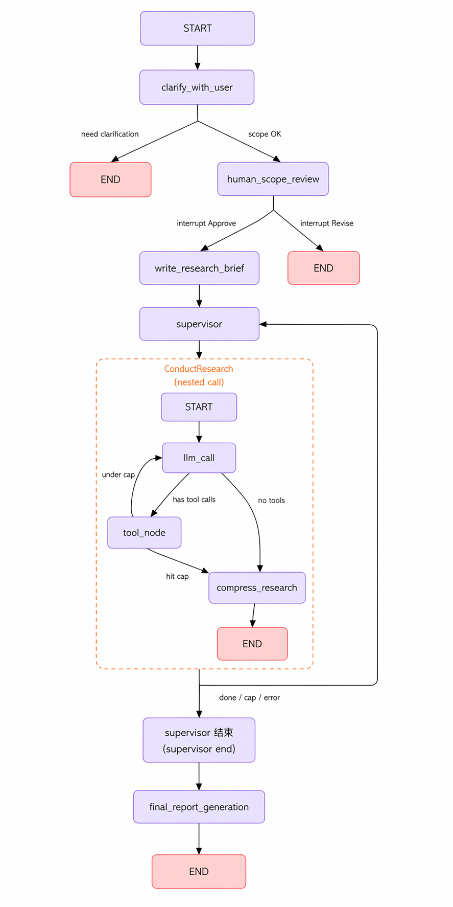

# Deep Research

A LangGraph **StateGraph** stack: scope the user’s goal with optional clarification, pause for human approval, materialize a **research brief**, run a **supervisor** graph that delegates **ConductResearch** calls into a per-topic **researcher** graph (Tavily, credibility filtering, compression), then a **final report** node. A FastAPI UI drives the same compiled graph with checkpointing (Redis Stack or in-memory).

## Requirements

- Python 3.11+ (recommended)
- API keys: OpenAI (or configured LangChain chat provider), Tavily, optional LangSmith
- For default checkpointing: Redis with RediSearch (see `docker-compose.yml`), or set `CHECKPOINT_BACKEND=memory`

## Quick start

```bash
python -m venv .venv
source .venv/bin/activate  # Windows: .venv\Scripts\activate
pip install -r requirements.txt
# Create .env in the project root with your API keys (OpenAI, Tavily, etc.)
```

Run the API:

```bash
uvicorn web:app --reload
```

Run the agent from the CLI (see `agent.py` / `src/full_agent.py`).

Docker:

```bash
docker compose up --build
```

## StateGraph architecture

The PNG matches how the code is wired: one **parent** graph on `AgentState`, a **supervisor** subgraph on `SupervisorState`, and a **researcher** subgraph on `ResearcherState` that the supervisor invokes for each `ConductResearch` tool call (nested runs, not a fourth compiled parent node).



### Parent graph (`src/full_agent.py`)

Built with `StateGraph(AgentState)` and `compile(checkpointer=…)`.

| Step | Role |
|------|------|
| `clarify_with_user` | Structured decision: if more scope is needed, appends a question and **ends the turn** (`Command` → `END`). Otherwise appends the verification line and goes to **human review**. |
| `human_scope_review` | `interrupt` for Approve / Revise. **Approve** → `write_research_brief`. **Revise** → message + **end turn** so the user can send a new scope. |
| `write_research_brief` | Produces `research_brief` and seeds `supervisor_messages` for the subgraph. |
| `supervisor_subgraph` | Compiled `StateGraph(SupervisorState)` (see below); output merges notes back into parent state. |
| `final_report_generation` | Consumes `research_brief` + accumulated `notes`, writes `final_report`, then **END**. |

Linear edges after scoping: `START → clarify_with_user` (via graph entry), `write_research_brief → supervisor_subgraph → final_report_generation → END`. Branches that end early are implemented with **`Command(goto=…)`** inside nodes, not only `add_edge`.

**`AgentState`** (see `src/state.py`): extends `MessagesState` with `research_brief`, `supervisor_messages`, `raw_notes`, `notes`, `final_report`.

### Supervisor subgraph (`src/supervisor.py`)

| Step | Role |
|------|------|
| `supervisor` | Lead-researcher LLM with tools (`ConductResearch`, `ResearchComplete`, `think_tool`); always routes to `supervisor_tools` via `Command`. |
| `supervisor_tools` | Executes tool calls: **think** returns observations; **ConductResearch** `ainvoke`s the researcher graph (possibly many in parallel). Stops the subgraph when iteration cap is hit, there are no tool calls, **`ResearchComplete`**, or an error—then **`Command` → `END`**. Otherwise loops back to **`supervisor`**. |

**`SupervisorState`**: `supervisor_messages`, `research_brief`, `notes`, `raw_notes`, `research_iterations`.

### Researcher subgraph (`src/research.py`)

Invoked as `researcher_agent` from the supervisor’s tool node. `StateGraph(ResearcherState, output_schema=ResearcherOutputState)`.

| Step | Role |
|------|------|
| `llm_call` | Research LLM with search/summarize tools. |
| `llm_call → …` | **Has tool calls** → `tool_node`. **No tool calls** → `compress_research`. |
| `tool_node` | Runs tools, increments `tool_call_iterations`. Under cap → back to `llm_call`; at cap → `compress_research`. |
| `compress_research` | Produces `compressed_research` (+ `raw_notes`) and **END** for that invocation. |

**`ResearcherState` / output**: per-topic messages, iteration count, topic string, compressed summary, and accumulated raw notes (see `src/state.py`).

## Project layout

| Path | Role |
|------|------|
| `web.py` | FastAPI app, templates, resume interrupts |
| `agent.py` | Async entry: `run_agent` / `resume_agent` |
| `src/full_agent.py` | Parent `StateGraph`, checkpointer, `final_report_generation` |
| `src/scoping.py` | `clarify_with_user`, `human_scope_review`, `write_research_brief` |
| `src/supervisor.py` | Supervisor loop and `ConductResearch` / researcher `ainvoke` |
| `src/research.py` | Researcher `StateGraph` (Tavily, compress) |
| `src/state.py`, `src/prompts.py`, `src/config.py` | State shapes, prompts, limits |
| `assets/` | README figures |

## License
